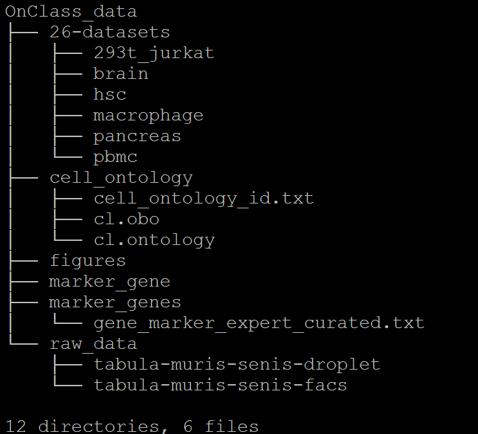

Dataset and pretrained models
=========
The datasets used by OnClass paper can be found at `figshare <https://figshare.com/projects/OnClass/70637>`__.

We provided the following datasets.

Currently, we include:

1) 26-datasets
~~~~~~~~~

26-datasets obtained from Scanorama project.

2) cell_ontology
~~~~~~~~~

The Cell Ontology file used in our analysis, which is downloaded from `OBO Foundry <http://www.obofoundry.org/ontology/cl.html>`__.

3) figures
~~~~~~~~~

Reproduced figures in the paper using OnClass.

4) marker_genes
~~~~~~~~~

Marker genes for 2331 cell types identified by OnClass and curated by experts

5) pretrained model
~~~~~~~~~

cell type embedding and pretrain prediction model

6) raw data
~~~~~~~~~

Gene expression data for FACS cells and droplet cells used in our analysis.

For questions about the datasets, please contact Sheng Wang at swang91@stanford.edu.
